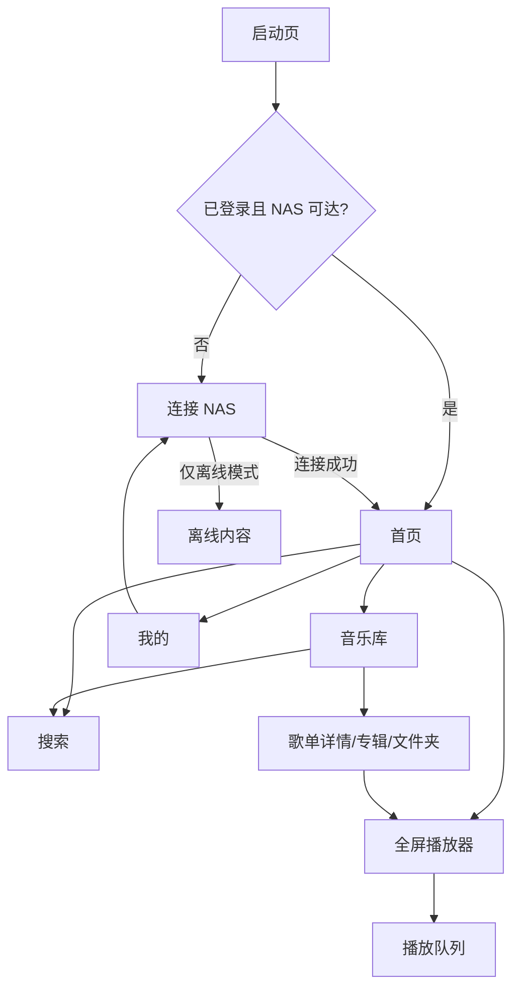

# 紫云音乐 PRD：群晖 NAS 音乐播放器

版本：v0.1  
日期：2026-06-01  
依据：`ui-mockups/index.html`、`ui-mockups/styles.css` 当前移动端 UI 稿  
目标平台：Android 手机端优先，后续可扩展平板、Android Auto、桌面端

## 1. 产品概述

紫云音乐是一款面向群晖 Synology NAS 用户的私有音乐播放器。用户可在局域网或互联网环境下连接自己的 NAS，读取 Audio Station/DSM 可访问的音乐库，实现浏览、搜索、播放、歌单、播放队列、离线缓存与基础管理。

产品核心不是在线曲库分发，而是让用户像使用主流音乐 App 一样顺畅地访问自己的私有音乐资产。当前 UI 已确定体验基调：轻内容页、深色沉浸播放器、紫色品牌主轴，并通过 HTTPS、NAS 在线状态、同步进度、连接诊断等信息强化“私有、安全、可信”的感受。

## 2. 产品目标

1. 让用户在 3 分钟内完成首次 NAS 连接并播放第一首歌。
2. 让 2 万到 5 万首规模的私有音乐库可以被稳定浏览、搜索和播放。
3. 在内网、外网、弱网、切换网络场景下保持可靠播放体验。
4. 支持用户将常听内容离线缓存，降低移动网络和 NAS 可达性依赖。
5. 建立可扩展的音乐库索引、播放队列、缓存、设置和诊断能力，为歌词、投放、均衡器、Android Auto 等后续能力预留空间。

## 3. 目标用户与场景

### 3.1 目标用户

- 家庭 NAS 用户：已有群晖 NAS，并在 NAS 中集中存放 FLAC、MP3、WAV 等音乐文件。
- Hi-Fi/本地音乐爱好者：重视原始音质、文件夹结构、专辑信息和离线播放。
- 多网络访问用户：在家使用局域网访问，在外使用 DDNS、反向代理、QuickConnect 或公网域名访问。
- 轻管理用户：不希望复杂配置，只想快速连接、同步、搜索和播放。

### 3.2 高频场景

- 首次打开 App，输入 NAS 地址和账号，安全连接。
- 在首页查看推荐、最近新增和当前播放内容。
- 在音乐库中按歌曲、专辑、歌手、文件夹、风格、年份、Hi-Res 浏览。
- 搜索歌曲、歌手、专辑、文件夹路径。
- 播放歌曲并在锁屏、通知栏、耳机按键中控制播放。
- 将歌单、专辑、文件夹下载到手机离线播放。
- 外网连接失败时查看诊断信息或进入离线模式。

## 4. 范围定义

### 4.1 V1.0 必做

- NAS 连接：手动地址、局域网发现、账号密码、两步验证码、HTTPS 证书校验、记住 NAS。
- 音乐库同步：歌曲、专辑、歌手、文件夹、风格、年份、音质标签、封面、基础统计。
- 首页：连接状态、搜索入口、今日推荐、最近新增、迷你播放器、底部导航。
- 音乐库：分段筛选、分类入口、排序、字母索引、文件夹播放。
- 歌单：本地歌单详情、播放全部、随机播放、下载、更多操作。
- 搜索：本机最近搜索、歌曲/专辑/文件夹聚合搜索、搜索结果跳转。
- 播放器：全屏播放、进度、缓冲、歌词占位、收藏、播放模式、上一首/下一首、队列入口。
- 播放队列：查看队列、调整顺序、随机、循环、清空、保存为歌单。
- 我的：NAS 状态、容量/缓存信息、离线下载、播放设置、安全设置、连接诊断。
- 离线模式：无 NAS 可达时可进入已缓存内容。

### 4.2 V1.0 可选或置灰

- 投放：UI 已出现“投放”，若 V1.0 不实现，需置灰并提示“后续版本支持”。
- 均衡器：UI 已出现“均衡器”，若 V1.0 不实现，需置灰或仅提供系统音效面板跳转。
- 歌词搜索：UI 明确提示“二期接入本地索引”，V1.0 仅展示已有歌词或占位。

### 4.3 暂不做

- 在线音乐服务、版权曲库、社交动态、评论。
- 跨用户共享歌单和云端账号体系。
- 复杂音乐识别、自动刮削第三方元数据。
- iOS、Web、桌面端实现。

### 4.4 优先级定义

- P0：没有该能力产品无法完成核心闭环，例如连接 NAS、同步音乐库、播放、离线模式。
- P1：强影响首版体验，建议 V1.0 完成，例如歌单、搜索、播放队列、下载管理、连接诊断。
- P2：可后续增强，例如歌词全文索引、投放、均衡器、多 NAS、Android Auto。

## 5. 信息架构

底部主导航包含 4 个一级入口：

1. 首页：状态、推荐、最近新增、搜索入口、迷你播放器。
2. 音乐库：歌曲、专辑、歌手、文件夹及分类维度。
3. 歌单：用户创建/保存的本地歌单，播放队列保存入口也写入此模块。
4. 我的：NAS、下载、播放、安全、外观、诊断设置。

全局浮层/子页面：

- 连接 NAS：首次启动、切换 NAS、重新登录时进入。
- 搜索页：首页/音乐库搜索入口进入。
- 全屏播放器：点击迷你播放器或播放页封面进入。
- 播放队列：播放器队列按钮进入底部抽屉。

## 6. 页面需求

### 6.1 启动页

对应 UI：01 启动页

核心目标：展示品牌、初始化状态、音乐库同步状态和连接可信状态。

功能需求：

- 展示 App 标识、产品名“紫云音乐”和副标题“你的 Synology 私有音乐库”。
- 已登录用户启动时自动检测 NAS 可达性、HTTPS 状态、账号会话有效性。
- 有本地索引时展示同步路径、同步进度和状态芯片，例如“HTTPS 已验证”“NAS 在线”。
- 若会话失效、NAS 不可达或首次启动，跳转连接 NAS 页。
- 启动时不得阻塞用户进入离线模式；本地已有缓存时允许跳过在线同步。

验收标准：

- 冷启动 2 秒内展示可感知页面。
- NAS 不可达时 5 秒内给出明确状态，不无限转圈。
- 本地有可播放缓存时，必须提供进入离线内容的路径。

### 6.2 连接 NAS

对应 UI：02 连接 NAS

核心目标：让用户以最低配置成本完成安全连接。

功能需求：

- 支持局域网发现设备，展示设备名、IP、Audio Station 能力状态。
- 支持手动输入 NAS 地址，格式包含 `http://`、`https://`、IP、域名、端口。
- 支持账号、密码、两步验证码输入。
- 默认开启“校验证书”和“记住此 NAS”。
- 点击“安全连接”后执行地址校验、证书校验、DSM 登录、Audio Station 能力检测。
- 支持“仅离线模式进入”，仅当本地存在离线内容或历史索引时可用。
- 证书异常时不得静默通过；如允许用户继续，必须展示风险提示并记录为非可信连接状态。

异常与提示：

- 地址不可达：提示检查网络、端口、DDNS/域名和防火墙。
- 账号或密码错误：提示重新输入，不清空 NAS 地址。
- 需要两步验证码：保留账号密码并聚焦验证码输入。
- Audio Station 不可用：提示安装/启用 Audio Station 或确认 DSM API 权限。
- HTTPS 证书不可信：提示证书问题，默认不继续。

验收标准：

- 内网发现至少支持同一网段 NAS 设备展示。
- 登录成功后安全存储会话信息，不以明文保存密码。
- 连接失败时错误原因可被用户理解，并可进入诊断。

### 6.3 首页

对应 UI：03 首页

核心目标：提供常用入口和轻量推荐，强调 NAS 在线状态与当前播放。

功能需求：

- 顶部展示当前 NAS 名称、在线状态、网络类型和音质状态，例如“内网在线 · FLAC 原始播放”。
- 提供搜索入口，支持搜索歌曲、歌手、文件夹。
- 展示“今日推荐”，推荐来源为本地元数据和播放历史，不依赖在线曲库。
- 展示“最近新增”，按 NAS 同步时间或文件入库时间排序。
- 底部展示迷你播放器，包括封面、歌曲名、来源/码率、播放/暂停、队列。
- 底部导航展示首页、音乐库、歌单、我的。

推荐规则：

- 优先使用最近播放、收藏、最近新增、完整专辑播放记录生成。
- 无播放历史时展示最近新增或随机高频专辑。
- 不上传用户曲库名称、歌手、路径等隐私数据用于推荐。

验收标准：

- 首页下拉/回到前台时刷新 NAS 在线状态。
- 推荐内容为空时展示最近新增兜底。
- 迷你播放器状态与全屏播放器保持一致。

### 6.4 音乐库

对应 UI：04 音乐库

核心目标：让大规模私有音乐库可浏览、可定位、可播放。

功能需求：

- 展示库统计：歌曲数、容量、最近同步时间、专辑数、歌手数、文件夹数。
- 支持歌曲、专辑、歌手、文件夹四个主维度切换。
- 支持风格、年份、Hi-Res 等分类入口。
- 支持按标题、歌手、专辑、年份、最近新增、播放次数排序。
- 歌曲列表展示封面、标题、歌手/专辑、格式或采样率、更多操作。
- 文件夹行展示路径、文件数量，并支持从该文件夹播放。
- 支持字母索引快速定位。
- 支持批量选择，用于下载、加入歌单、加入队列、删除本地缓存。

数据要求：

- 元数据字段：标题、歌手、专辑、专辑艺术家、曲号、碟号、年份、风格、时长、文件格式、码率、采样率、位深、路径、文件大小、修改时间、封面。
- 对缺失元数据的歌曲，使用文件名、父文件夹和默认封面兜底。
- 音乐库索引保存在本地数据库，支持离线浏览已同步元数据。

验收标准：

- 5 万首歌曲列表滚动流畅，无明显卡顿。
- 搜索/排序/切换分类不阻塞主线程。
- 同步期间可继续浏览已有内容。

### 6.5 歌单列表与歌单详情

对应 UI：底部导航“歌单”入口、05 歌单详情

核心目标：承载用户收藏、保存和组织私有曲库的主要集合。

功能需求：

- 歌单一级页展示本地歌单、最近播放、收藏歌曲、已下载歌单、从播放队列保存的歌单。
- 歌单一级页支持新建歌单、搜索歌单、按更新时间/名称/歌曲数排序。
- 展示歌单封面、名称、歌曲数、总时长、更新时间。
- 支持播放全部、随机播放、下载、更多操作。
- 列表展示序号、歌曲名、歌手、下载状态、正在播放状态。
- 支持歌曲更多操作：下一首播放、加入队列、加入其他歌单、下载/取消下载、查看文件信息、从歌单移除。
- 支持从播放队列保存为歌单。
- 本地歌单默认存储在 App 本地；后续可扩展同步到 NAS 自定义目录或 Audio Station 歌单。

验收标准：

- 歌单播放时队列顺序与列表一致。
- 删除歌单歌曲不删除 NAS 原文件。
- 下载歌单时可展示整体进度和单曲失败项。
- 从底部导航进入歌单时，必须有可用的歌单一级页，不直接跳到某个固定详情页。

### 6.6 搜索

对应 UI：06 搜索

核心目标：快速定位歌曲、专辑、歌手和文件夹。

功能需求：

- 搜索框支持实时输入，默认展示最近搜索。
- 支持分段筛选：全部、歌曲、专辑、文件夹。
- 搜索结果按类型聚合展示，包含结果数量。
- 搜索范围包含标题、歌手、专辑、文件夹路径、文件名、格式标签。
- 最近搜索仅保存在本机，可手动清除。
- 歌词搜索为二期能力，V1.0 展示提示或隐藏入口。

搜索策略：

- 本地索引优先，保证离线可搜索已同步数据。
- 远程增量搜索可作为补充，但不得影响本地搜索结果展示。
- 中文、英文、大小写、空格、路径分隔符应做基础归一化。

验收标准：

- 2 万首规模下输入后 300ms 内展示本地结果。
- 无结果时给出空状态，并提供检查同步/切换关键词建议。
- 点击歌曲结果立即进入播放或详情，点击专辑/文件夹进入对应列表。

### 6.7 全屏播放器

对应 UI：07 全屏播放器

核心目标：提供沉浸播放、音质可信和核心播放控制。

功能需求：

- 顶部展示来源 NAS 和当前音质，例如“来自 DiskStation-Home”“原始 FLAC”。
- 展示唱片式封面动画；播放时旋转，暂停时停止。
- 展示歌曲名、歌手、收藏状态。
- 展示歌词区域：有歌词时逐行高亮，无歌词时展示占位或隐藏。
- 展示进度、缓冲进度、当前时间、总时长。
- 支持随机、上一首、播放/暂停、下一首、队列。
- 底部工具展示缓存状态、投放、均衡器。
- 支持后台播放、锁屏控制、通知栏控制、蓝牙耳机按键。
- 网络切换或临时断网时，优先使用缓冲继续播放，并给出轻量提示。

播放策略：

- 默认原始音质播放；当外网带宽不足或格式不兼容时，可按用户设置启用转码/降级。
- 支持 HTTP Range，保证拖动进度时可准确 seek。
- 播放失败时自动尝试下一首，并记录失败原因供诊断查看。

验收标准：

- 播放/暂停状态在迷你播放器、通知栏、全屏播放器中一致。
- 进度条拖动后 1 秒内恢复播放或给出缓冲状态。
- App 切后台后播放不中断，系统回收后可恢复播放队列。

### 6.8 播放队列

对应 UI：08 播放队列

核心目标：让用户掌控当前播放顺序。

功能需求：

- 以底部抽屉展示当前队列。
- 展示播放模式和队列歌曲数，例如“顺序播放 · 30 首”。
- 支持保存为歌单。
- 支持随机、循环、清空。
- 支持拖拽排序。
- 当前播放歌曲高亮。
- 每首歌支持更多操作。

验收标准：

- 调整队列后下一首播放顺序立即生效。
- 保存为歌单后可在歌单页找到。
- 清空队列前需要确认；当前正在播放歌曲的处理逻辑需明确。

### 6.9 我的

对应 UI：09 我的

核心目标：集中管理连接、安全、下载和播放偏好。

功能需求：

- 展示当前 NAS 名称、地址、在线状态。
- 展示音乐库容量和本机缓存剩余空间。
- 展示离线下载概览：已下载数量、下载中数量、总进度。
- 设置项包括播放设置、仅 Wi-Fi 下载、外观设置、安全设置。
- 展示连接诊断结果，例如“DSM API 与 Audio Station 能力可用”。
- 支持进入 NAS 管理、下载管理、播放设置、安全设置、外观设置、连接诊断。

设置要求：

- 播放设置：原始音质/自动转码、自动播放、缓存大小、播放增益、淡入淡出可后续扩展。
- 下载设置：仅 Wi-Fi 下载、移动网络确认、缓存目录、空间上限、下载失败重试。
- 安全设置：证书校验、登录设备、清除凭据、退出登录。
- 外观设置：跟随系统、浅色、深色。

验收标准：

- NAS 状态变化能在 10 秒内刷新或在用户手动刷新后更新。
- 诊断结果能定位到网络、认证、证书、API、Audio Station 权限等层级。
- 清除缓存不得删除 NAS 原文件。

### 6.10 当前 UI 缺口

当前 UI 稿已覆盖核心体验，但以下页面/状态在研发前建议继续补图或补交互说明：

- 歌单一级页：展示用户创建歌单、收藏歌单、最近保存队列、空状态与新建歌单入口。
- 下载管理详情页：展示下载中、已下载、失败、暂停、仅 Wi-Fi 限制、存储不足等状态。
- 播放设置详情页：原始音质、自动转码、缓存大小、播放增益、淡入淡出等配置。
- 安全设置详情页：证书校验、信任例外、清除凭据、退出登录、设备登录记录。
- 外观设置详情页：跟随系统、浅色、深色，以及深色播放器之外的全局主题表现。
- 连接诊断详情页：逐项展示网络、DNS、端口、证书、DSM、Audio Station、音频流检测结果。
- 空状态和错误态：无音乐、无搜索结果、NAS 离线、登录过期、证书异常、同步失败、播放失败。
- 批量选择状态：歌曲列表批量下载、加入歌单、加入队列、取消选择。
- 歌曲/专辑/文件夹详情页：更多操作、文件信息、路径展示、下载状态。

## 7. 核心业务流程

### 7.1 首次连接流程

1. 用户打开 App。
2. App 检查是否存在已保存 NAS。
3. 无保存 NAS 时进入连接页。
4. App 自动执行局域网发现。
5. 用户选择发现设备或输入 NAS 地址。
6. 用户输入账号密码和可选两步验证码。
7. App 校验证书、登录 DSM、检测 Audio Station。
8. 成功后保存 NAS 配置和安全会话。
9. 进入首页并开始初次音乐库同步。

### 7.2 音乐库同步流程

1. App 获取远端音乐库目录和元数据。
2. 写入本地索引数据库。
3. 增量获取封面和必要音频信息。
4. 生成分类维度、搜索索引和首页推荐数据。
5. 同步结果写入最近同步时间和诊断日志。

同步策略：

- 初次同步优先同步可浏览字段，封面可异步加载。
- 增量同步根据远端修改时间、文件数量、API 返回游标或目录扫描结果更新。
- 同步失败可重试，不影响已完成数据。
- 用户播放某首歌时，该歌曲元数据和封面优先补全。

### 7.3 播放流程

1. 用户从首页、音乐库、歌单、搜索或文件夹点击歌曲/播放全部。
2. App 生成播放队列。
3. 播放器请求可播放 URL 或数据流。
4. 播放前检查网络、登录态、格式支持、缓存命中。
5. 开始播放并更新迷你播放器、全屏播放器、通知栏。
6. 播放过程中持续更新进度、缓冲、播放历史。
7. 播放结束后按队列和播放模式切换下一首。

### 7.4 离线下载流程

1. 用户对歌曲、专辑、歌单或文件夹点击下载。
2. App 检查 Wi-Fi 设置、存储空间和任务重复。
3. 加入下载队列。
4. WorkManager/前台服务执行下载。
5. 下载完成后写入本地缓存表和离线可用标记。
6. 用户在无网或 NAS 不可达时可播放已缓存内容。

## 8. NAS 与接口要求

### 8.1 连接方式

- 局域网：支持 IP/主机名访问，局域网发现能力优先。
- 互联网：支持 HTTPS 域名、DDNS、反向代理、端口访问；QuickConnect 可作为后续专项评估。
- 地址配置应允许端口，例如 `https://home-nas.example.com:5001`。
- App 不负责用户公网穿透配置，但需提供错误提示和诊断方向。

### 8.2 Synology 能力要求

- DSM 账号登录和会话管理。
- Audio Station 或等价音乐服务能力检测。
- 音乐库列表、元数据、封面、音频流 URL 或可读取文件流。
- 远端接口路径、版本和能力应以 NAS 返回的 API 信息为准，不在客户端硬编码单一版本。

### 8.3 账号与权限

- 推荐用户使用独立 `music_user` 账号。
- 账号至少需要音乐目录读取权限和 Audio Station 使用权限。
- App 不需要 NAS 管理员权限。
- 登录失败超过限制时提示用户可能触发 DSM 安全策略。

## 9. Android 技术要求

### 9.1 推荐技术栈

- 语言：Kotlin。
- UI：Jetpack Compose 或原生 View 体系；若采用 Compose，需复刻当前 UI 的导航、卡片、播放器和底部抽屉体验。
- 播放：AndroidX Media3/ExoPlayer，接入 MediaSession。
- 本地数据：Room 存储音乐库索引、歌单、队列、下载任务；DataStore 存储轻量设置。
- 后台任务：WorkManager 处理同步和下载；播放使用前台媒体服务。
- 图片：支持远程封面、本地封面缓存和默认封面。
- 依赖注入与架构：Hilt/Koin + MVVM 或单向数据流。

### 9.2 系统能力

- 后台播放和前台服务通知。
- 锁屏媒体控制。
- 蓝牙耳机线控。
- 网络状态监听，区分 Wi-Fi、蜂窝、无网。
- 存储空间检测和缓存清理。
- 可选局域网发现所需的网络/附近设备权限，应在用户触发发现时再请求。

### 9.3 权限建议

- `INTERNET`：访问 NAS。
- `ACCESS_NETWORK_STATE`：判断网络类型和可达性。
- `POST_NOTIFICATIONS`：Android 13+ 展示播放/下载通知。
- `FOREGROUND_SERVICE_MEDIA_PLAYBACK`：媒体前台服务。
- `WAKE_LOCK`：长时间播放或下载时保持必要任务。
- 本地文件读取权限仅在支持导入手机本地音乐时需要，V1.0 不作为必需权限。

## 10. 数据模型

核心实体：

- `NasAccount`：NAS 名称、地址、连接方式、证书状态、登录状态、最近连接时间。
- `Track`：歌曲元数据、文件路径、音频格式、码率、采样率、时长、封面引用、远端 ID。
- `Album`：专辑名、专辑艺术家、年份、封面、曲目数。
- `Artist`：歌手名、歌曲数、专辑数。
- `Folder`：路径、文件数、子目录、最近更新时间。
- `Playlist`：名称、封面、歌曲数、总时长、创建/更新时间、来源。
- `QueueItem`：队列位置、播放来源、当前歌曲标记。
- `DownloadItem`：下载状态、进度、失败原因、本地路径、重试次数。
- `PlaybackHistory`：播放时间、播放时长、完成度、来源。
- `SyncState`：同步状态、进度、最近成功时间、失败原因。

本地索引原则：

- 远端 ID 不稳定时，使用路径 + 文件大小 + 修改时间生成本地稳定标识。
- 删除远端文件后，本地索引标记为不可用，不立即删除播放历史。
- 下载文件与索引解耦，清除缓存不影响歌单和历史。

## 11. 播放与缓存策略

### 11.1 播放支持

V1.0 应优先支持常见格式：

- 有损：MP3、AAC、M4A、OGG。
- 无损：FLAC、WAV、ALAC，具体能力以 Android 解码器和播放器支持为准。
- Hi-Res：展示采样率、位深等信息；是否 bit-perfect 输出作为后续专项。

### 11.2 缓冲

- 播放时显示缓冲进度。
- 支持拖动 seek，远端需支持 Range 请求或等效分段读取。
- 弱网时显示“正在缓冲”，避免误判为暂停。

### 11.3 离线缓存

- 显式下载内容进入离线库。
- 临时播放缓存可被系统或 App 清理，不承诺永久可用。
- 支持按歌曲、专辑、歌单、文件夹下载。
- 支持仅 Wi-Fi 下载、下载中暂停/继续/取消。
- 缓存达到上限时优先清理临时缓存，再提示用户管理离线下载。

## 12. 安全与隐私

安全要求：

- 默认使用 HTTPS 并校验证书。
- 密码不落盘；会话 token、sid 或刷新凭据使用 Android Keystore/加密存储。
- 退出登录时清除会话和敏感凭据。
- 连接非可信证书时展示明显风险，不把状态显示为“HTTPS 已验证”。
- 下载文件存储在 App 私有目录，除非用户明确导出。

隐私要求：

- 用户的歌曲名、歌手、文件路径、播放历史默认仅存本机。
- 如后续接入崩溃或统计服务，不上传曲库明细和 NAS 地址明文。
- 诊断日志需脱敏：隐藏账号、密码、token、完整公网域名可部分打码。

## 13. 视觉与交互规范

基于当前 UI 稿：

- 品牌主色：`#7c3aed`；深色播放器主轴：`#2e1065`；NAS/连接提示色：`#06b6d4`；收藏色：`#ec4899`。
- 内容页以浅色背景、8px 圆角、清晰列表为主。
- 播放器使用深色沉浸背景和唱片封面动画。
- NAS、HTTPS、缓存、音质等状态要显性展示，降低私有网络访问的不确定感。
- 底部导航固定四项，迷你播放器位于底部导航上方。
- 主要操作使用图标 + 文案，例如“安全连接”“播放全部”；播放器控制以图标为主。
- 所有长标题、长路径、长域名需单行省略或在详情页完整展示。

无障碍要求：

- 所有图标按钮必须有可读的 contentDescription。
- 播放、暂停、收藏、下载状态变化需要能被 TalkBack 感知。
- 点击热区不小于 44dp。
- 深色播放器中的文字和控制按钮需满足对比度要求。

## 14. 性能与稳定性指标

- 冷启动首屏：目标 2 秒内。
- 首次连接后首批可浏览歌曲：目标 10 秒内出现，完整同步后台继续。
- 本地搜索响应：2 万首 300ms 内返回首批结果。
- 列表滚动：5 万首规模保持 60fps 目标，至少无明显掉帧。
- 播放起播：内网 1 秒内，外网 3 秒内开始播放或展示缓冲。
- 崩溃率：正式版 crash-free users 大于 99.5%。
- 播放中断率：非用户主动暂停的中断需可统计并持续降低。
- 下载任务：App 进入后台后可继续，系统限制导致暂停时需可恢复。

## 15. 埋点与诊断

埋点原则：默认不记录具体曲名、歌手、路径、NAS 完整地址。

建议事件：

- `nas_connect_start`
- `nas_connect_success`
- `nas_connect_failed`
- `library_sync_start`
- `library_sync_success`
- `library_sync_failed`
- `search_performed`
- `play_start`
- `play_failed`
- `buffer_stall`
- `download_start`
- `download_success`
- `download_failed`
- `offline_mode_enter`
- `diagnostic_run`

诊断输出：

- 网络可达性。
- DNS/域名解析。
- 端口连通性。
- HTTPS 证书状态。
- DSM 登录状态。
- Audio Station/API 能力。
- 音频流 URL 获取和 Range 支持。
- 本地数据库、缓存目录、剩余空间。

## 16. 发布计划

### 16.1 Alpha

- 完成连接 NAS、登录、音乐库基础同步。
- 完成歌曲列表、搜索、基础播放。
- 支持迷你播放器和全屏播放器。
- 支持基础离线下载。

### 16.2 Beta

- 补齐专辑、歌手、文件夹、歌单、播放队列。
- 完成后台播放、通知栏、锁屏控制。
- 完成下载管理、连接诊断、安全设置。
- 进行 2 万首以上音乐库压力测试。

### 16.3 V1.0

- 完成 UI 稿中全部 P0/P1 可用路径。
- 完成异常态、空状态、弱网、离线模式。
- 完成隐私脱敏、崩溃监控和基础性能优化。
- 投放/均衡器若未完成，需在 UI 中明确置灰或隐藏。

### 16.4 V1.1 及以后

- 歌词本地索引和逐字/逐行同步。
- 投放到 Chromecast/DLNA/AirPlay 兼容设备。
- 均衡器和播放增益。
- 多 NAS 管理。
- Android Auto。
- 更智能的本地推荐和重复歌曲识别。

## 17. 验收清单

连接：

- 首次连接、记住 NAS、重新连接、退出登录均可正常完成。
- 内网和外网地址均可配置。
- 证书异常、账号错误、验证码缺失、Audio Station 缺失都有明确提示。

音乐库：

- 歌曲、专辑、歌手、文件夹四个维度可浏览。
- 元数据缺失时有兜底展示。
- 同步失败不影响已同步内容使用。

播放：

- 任意入口点击歌曲可生成队列并播放。
- 播放状态在全屏播放器、迷你播放器、通知栏一致。
- 切后台、锁屏、蓝牙耳机控制可用。
- 断网、弱网、token 过期时有可恢复策略。

离线：

- 歌曲、专辑、歌单、文件夹可下载。
- 仅 Wi-Fi 下载生效。
- NAS 不可达时已下载歌曲可播放。
- 清理缓存不删除 NAS 原文件。

搜索：

- 支持歌曲、专辑、文件夹搜索。
- 最近搜索本机保存并可清理。
- 无结果和歌词搜索二期提示符合 UI。

我的：

- NAS 状态、缓存空间、下载状态准确。
- 播放、安全、外观设置可进入。
- 连接诊断可定位常见故障。

## 18. 风险与待确认

- Audio Station API 能力和 DSM 版本差异需要通过真实设备验证。
- QuickConnect 是否纳入 V1.0 需评估授权、性能和稳定性。
- 外网访问依赖用户网络配置，产品需通过诊断降低排障成本。
- 自签证书用户比例可能较高，需要在安全和易用之间平衡。
- 大曲库封面同步可能消耗大量流量和存储，需要懒加载与缓存上限。
- Hi-Res 原始播放受设备解码、USB DAC、系统混音限制，是否承诺 bit-perfect 需单独定义。
- 投放和均衡器已在 UI 出现，研发范围若不包含，需要产品在首版视觉中处理预期。

## 19. 待产品决策问题

1. V1.0 是否必须支持 QuickConnect，还是仅支持内网 IP、DDNS、域名和反向代理？
2. 歌单是否需要同步回 NAS，还是 V1.0 仅本机保存？
3. 离线下载文件是否允许用户导出到公共目录？
4. 是否支持多 NAS 账号切换？
5. 自签证书是否允许用户添加信任例外？
6. 投放和均衡器是否进入 V1.0 范围？
7. 首页“今日推荐”是否仅基于本地规则，是否需要用户可关闭？
